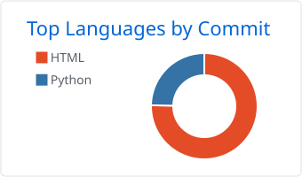

<picture>
  <source media="(prefers-color-scheme: dark)" srcset="profile/stats-dark.svg">
  
</picture>
<picture>
  <source media="(prefers-color-scheme: dark)" srcset="https://trophy.ryglcloud.net/?username=CCXXXI&theme=onedark&no-bg=true&no-frame=true&margin-w=6">
  
</picture>
<picture>
  <source media="(prefers-color-scheme: dark)" srcset="profile-summary-card-output/github_dark/0-profile-details.svg">
  
</picture>
<picture>
  <source media="(prefers-color-scheme: dark)" srcset="profile-summary-card-output/github_dark/2-most-commit-language.svg">
  
</picture>
<picture>
  <source media="(prefers-color-scheme: dark)" srcset="profile-summary-card-output/github_dark/4-productive-time.svg">
  
</picture>
